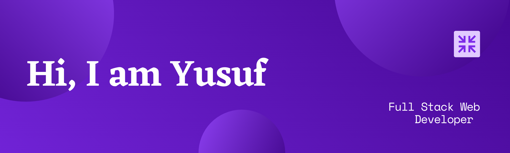

<!-- You can create your own header images using Canva, it has a lot of templates. If you do, use the following link https://www.canva.com/join/celeriac-tread-jellyfish -->
I'm a tech enthusiast who loves to learn about new things. </a>

:heart: Let's get connected:

## 🇮🇩 About Me:
- :student: I'm currently a Fresh Graduate
- :rocket: Always ready to collaborate for Dev Experiments
- :zap: Fun fact: I love to attend Meetups for learning & Conferences for Networking
- :hourglass_flowing_sand:  Exploring Google Cloud, Python and more

## :rocket: :computer: Technologies & Tools

